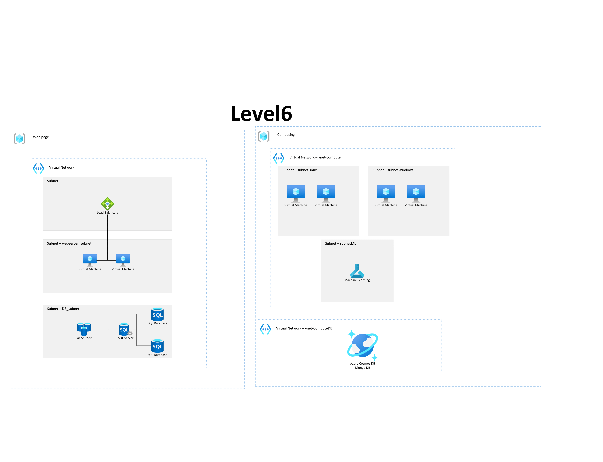

# Level 6

Sett up a Web page with a LoadBalancer, 2 web servers, SQL-db and redis cache.  
Set up a smal basic computing enviroment 

### Two resource groups.
- One for a web page(Vnet-web):
    - Load Balancer
    - 2 Web server (Linux)
    - SQL server
        - 2 SQL databases
    - Redis Cache
    - 3 Subnets
        - database
        - web server
        - Loadbalancer
 
- One for computing:
    - VNet Computing
        - 2 Linux server
        - 2 Windows server
        - ML compute instance
        - 3 subnets 
            - Linux
            - Windows
            - ML
    - Vnet ComputeDB
        - Cosmos DB 
            - running MongoDB

### Inrastructure Vizulized

